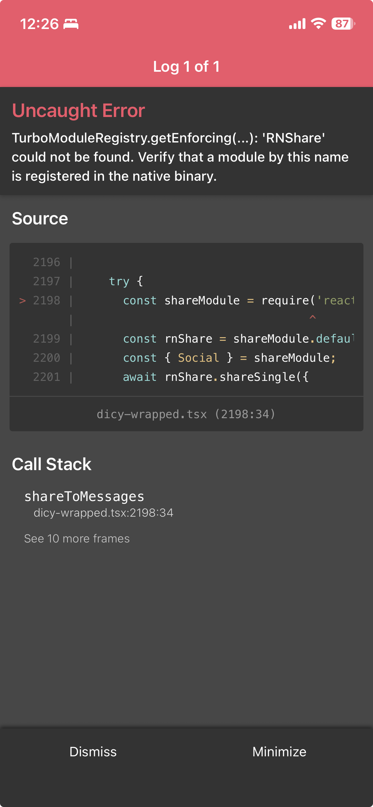

My first post about Dicy was pretty simple. "bessy is broken :(" followed by "so i built the next version."

I wanted to check what would happen to my grade if I changed an assignment score, or what I needed on a final. Bessy had made that easy. When it stopped working, I started building something I could use myself. The first announcement even said it looked and felt like Bessy. I wasn't trying to hide where the idea came from.

## Figuring out Infinite Campus

Before I could make the app useful, I had to figure out where Infinite Campus got its data. I opened the portal, watched its network requests, and saved captures while moving between grades, assignments, and terms. There are still files in my Downloads called `infinitecampusnew1.har` and `termsinfcampus.har`.

The portal didn't hand me a finished grade tracker. Course grades and assignment details came back through different requests. Categories and terms mattered too. I had to work out how those responses fit together before I could show the same information in Dicy.

Then came the calculations. Showing a grade is one thing. Letting someone change a score and telling them what their grade would become means getting the weighting right. An assignment's percentage doesn't tell you how much it affects the course. A what-if result is useless if it disagrees with the grade people see at school.

*An early version from April 17. Most of the screenshots around it are slightly different versions of the same screens.*

That was a lot of the early work. Change something, compare it with the portal, find another case, change it again. The screenshots aren't a neat sequence where each one suddenly looks better. There are a lot of near-duplicates.

## Getting it into people's hands

The App Store approved Dicy in April. After that, I kept adding things people could use during the school day, including a web version they could pair with their phone and home-screen widgets. Android took longer. While I waited for production access, I put out a beta so people could try it before the school year ended.

My v1.1 announcement included "works on school wifi" and "fixed final grade calculator." Those were the kinds of things I was working on alongside the new screens. An app that looks finished in my screenshots can still fail when someone opens it at school.

Supporting more people also meant finding problems I couldn't see with my own account. Later, Dublin's direct Infinite Campus login was still broken, and responsive schedules sometimes failed to load or update. I went back to captured requests to figure out what was different. I also worked on better error reports because "it doesn't work" doesn't give me much to debug. I needed enough information to find the failure without collecting someone's password or session tokens.

Dicy grew to 3,000+ users, and I added Schoology support too. There were more people using it, but there were also more versions of the same problem to check. I was still dealing with grade calculations, login behavior, and schedules after the first release.

## Wrapped

Around the end of the school year, I wanted to make Dicy Wrapped. I liked the idea of looking back at the assignments that saved your grade, the ones that hurt it, and just how much work you'd done that year.

I tried a bunch of AI-generated designs. Some had enormous logos and colored shapes everywhere. I kept changing them because I wasn't happy with how they looked. In the early share screen below, the course names get cut off so badly that two different entries both start with "AP Calculu...". You can't really tell what you're looking at.

*An early share screen and the later card. The later version names the assignments and puts the course underneath.*

The rankings needed work as well. A big percentage increase on one assignment wasn't automatically the biggest clutch of the year. It had to reflect the assignment's effect on the overall grade. Otherwise the card could look convincing and still tell the wrong story. That's why the later card says the rankings use clutch and dip factors rather than raw percentages.

And then I had a share screen that couldn't share. I still have a screenshot from 12:26 a.m. on June 3 where the Messages button throws an error because the native sharing module isn't in the app build.

*This is what happened when I tried to send the card through Messages.*

Wrapped eventually got over 120 shares on Instagram and 200 through Messages. People were sending their school year to friends, which was what I'd wanted them to do in the first place. After going through so many drafts and getting stuck on the sharing itself, seeing those numbers felt good.

[Dicy](https://dicy.app) is still changing. The saved screenshots cover everything from those first grade screens to widgets and Wrapped. I wanted to keep some of the unfinished ones here too, because they're a better record of building it than another picture of the final app.
