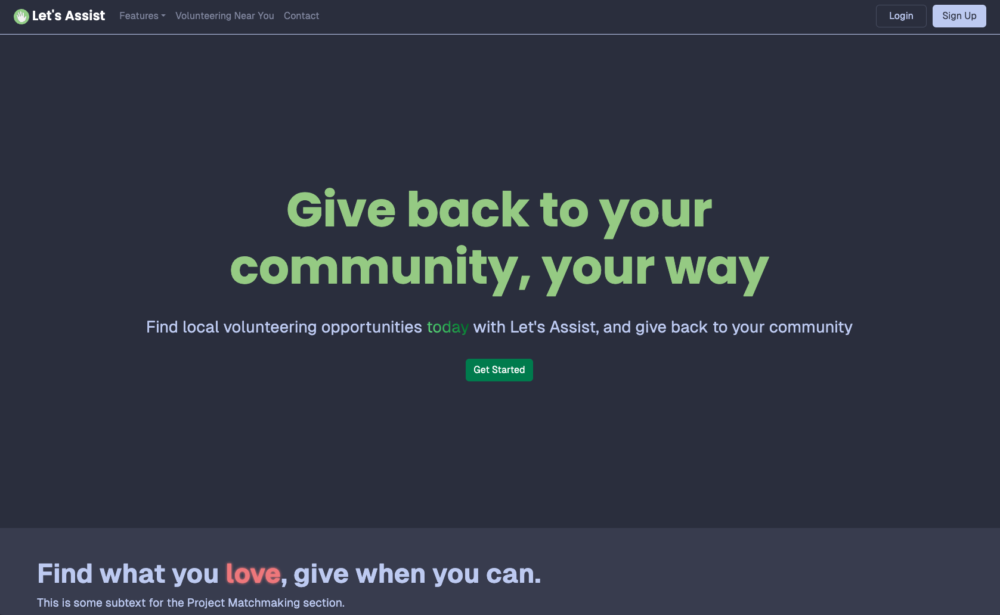
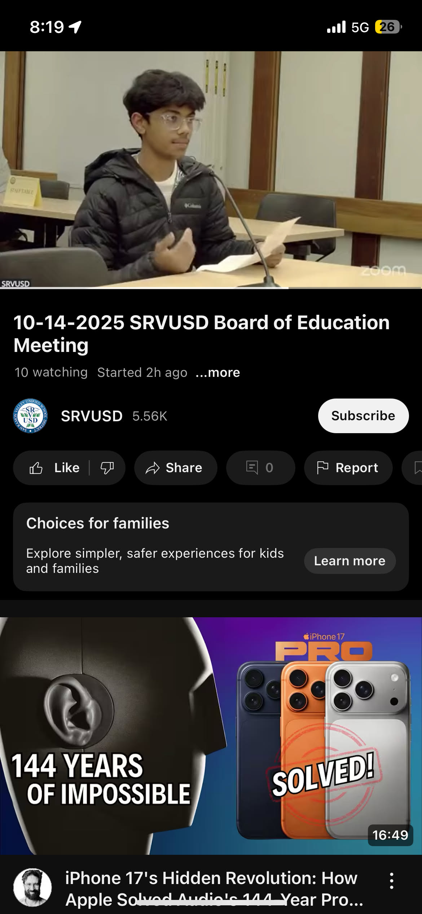
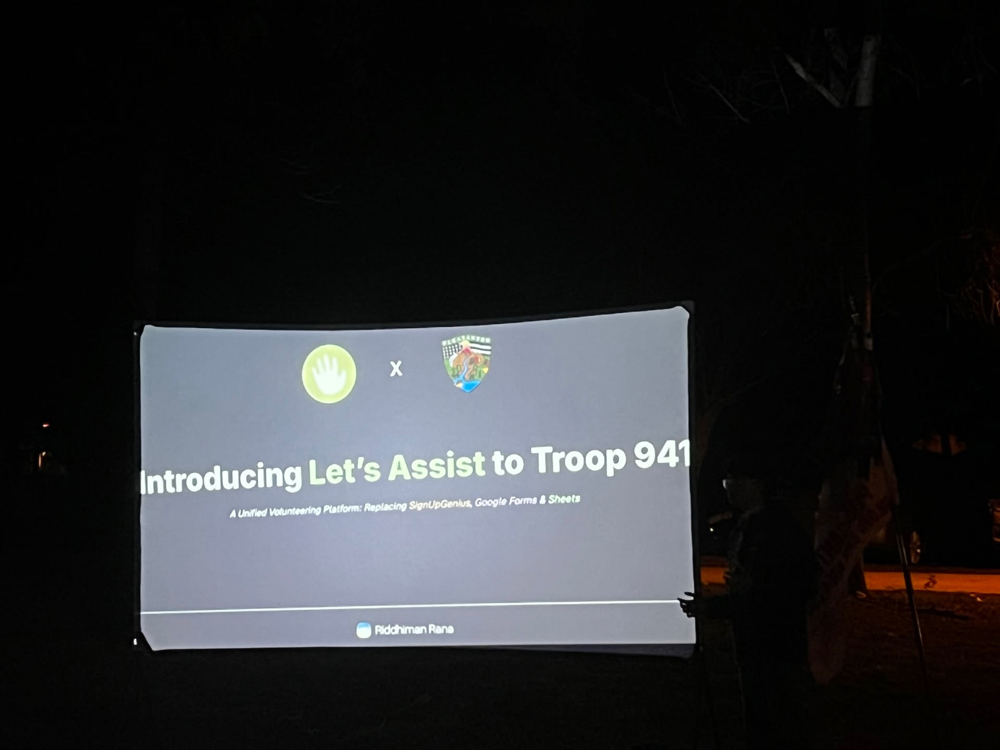
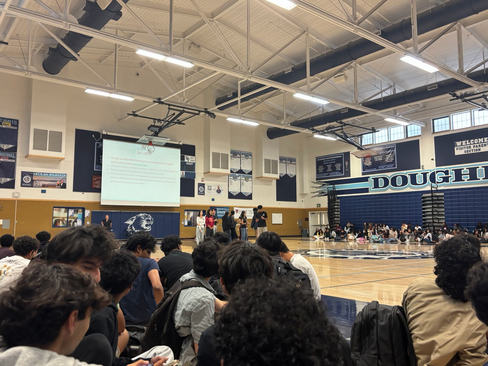
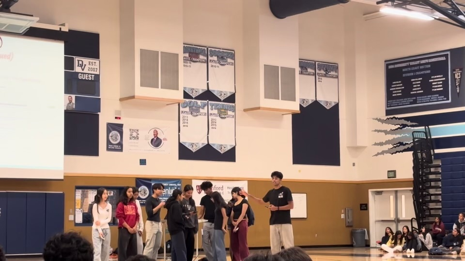

Let's Assist started in 2023, after a trip to Santa Cruz where I saw trash on the beach and started picking it up. I wanted an easier way to get other people involved in something like that. At school, CJSF gave me another reason to work on it. Finding volunteer opportunities and getting hours signed off involved a lot of separate steps.

I built the first version with a friend for HarvestHacks that November. We had mostly done competitive programming before, so a full-stack website was new to us. I worked on the frontend, login, APIs, and database connection. We started with fake data, then tried connecting the real database. That meant reworking parts of the app, dealing with authentication problems, and fixing requests that kept returning 404s.

*The first version. It still has placeholder text under the main section. The [original submission](https://devpost.com/software/let-s-assist) is still online.*

We didn't win, and I left the project alone for about a year. I picked it back up in December 2024 and rebuilt it. This time I wanted people to be able to use it for an actual event, including recording their hours afterward.

## Asking people to try it

By 2025, I had something I could show to teachers and organizations. I started with people around me, including my old middle school and Troop 941. The problem I was trying to fix was familiar to them. Signups lived in one place, hours in another, and someone had to sort out the records afterward.

But being interested in the idea wasn't the same as being able to use it. A teacher at WRMS was willing to explore it, but the school couldn't endorse a platform the district hadn't approved. When she tried setting up a cleanup, my trusted-member requirement stopped her from creating the event. I'd added it to control who could post, and now it was blocking someone I wanted to help.

She also asked for recurring events, calendar integration, and saved drafts. I worked on those while trying to keep up with school. In one October email, I asked her to wait until the next afternoon while I finished the changes. The next day, I was still dealing with Google verification and had a chapter test. It was taking longer than I'd told her.

I spoke at the SRVUSD board meeting on October 14, 2025. Afterward, I worked through my CS teacher, counselor, and school administrators to reach IT. By January, I'd contacted more than 70 clubs, teachers, administrators, PTA members, and local organizations. A lot of that was follow-up emails and trying to find a lunch or after-school meeting that worked.

*The [board recording starts at 1:29:54](https://www.youtube.com/watch?v=jCHJ60q5PjY&t=5394s).*

## The meetings that didn't turn into a launch

In January, I met with an Interact advisor and Scott Gerbert, who also worked with local volunteer events. They showed me what they needed for registration and waivers. I went back and worked on electronic waivers, event drafts, reports, and Google Sheets syncing.

We first discussed Truck Time, then Run for Education. By the end of the month, the Education Foundation had decided to use an established system with tech support. I'd already spent time building around the conversations, so that was hard to hear. Scott still wanted to help me find somewhere to test it.

I sent him a pretty long reply. I was worried people saw Let's Assist as a high-school project I would drop after college applications. I wanted it to be something I kept working on for years, but saying that in an email wasn't enough to make someone comfortable putting their event on it.

Troop 941 gave me somewhere to use it for real. We'd been talking about it since the previous summer. By February, I was presenting it to the troop and showing how signups, waivers, and reports would work together. Having leadership willing to try it meant I could find problems during real events instead of only showing another demo.

*Introducing it to the troop. These are the [slides I used](https://docs.google.com/presentation/d/1lVeFxzUxJy5fYManfnKKaGm5ZL4MEiE0SFMuL2PEHp4/edit).*

Other trials were smaller. Hearts4Hands tried an event that got six signups, but we hadn't got the link to CSF in time. The Knights of Columbus brought up members who wouldn't want to create accounts, so manual signups and CSV imports mattered. PTA conversations included questions about who would be responsible for the platform. Those were things people needed settled before they could use it.

The district process kept going too. CITE invited me to review and sign a data privacy agreement in February. I met with SRVUSD's IT director in March, followed up over the next few months, and got referred to the data manager in May. My family also worked on putting Let's Assist under Tulip Coaching LLC. The agreement wasn't signed, so this wasn't district approval.

## CSF

On March 27, a student emailed me about CSF officer applications. They closed in two hours. I asked which position would give me a chance to bring Let's Assist into the club. She suggested webmaster or secretary.

CSF had records and processes that already existed. I couldn't ask everyone to start over just to fit my app. Membership, meeting attendance, activities, and point submissions all needed to work together, including the old spreadsheets officers had been maintaining.

A lot of the work was figuring out which records belonged to which person. Someone could have attendance recorded before they ever made an account. Similar names couldn't be enough to connect records, especially when those records determined membership or points. Officers needed a way to review uncertain connections and see where imported information came from.

That work took much longer than putting an event page on the site. Meanwhile, I was also working on a Speech and Debate integration. In May, I had to send an update saying it was taking longer than expected because of competitions, AP exams, and problems with the Tabroom and judges workflows. There were several conversations moving at different speeds, and I couldn't finish everything on the timelines I'd hoped for.

By September, we were introducing Let's Assist at CSF for posts, activities, and point submissions. The platform now has 900+ users. That meeting came after months of asking people to try it, following up, and changing the app around what they needed. I still have district conversations and integrations to work through. But at CSF, I could finally show it to the people who would be using it.
