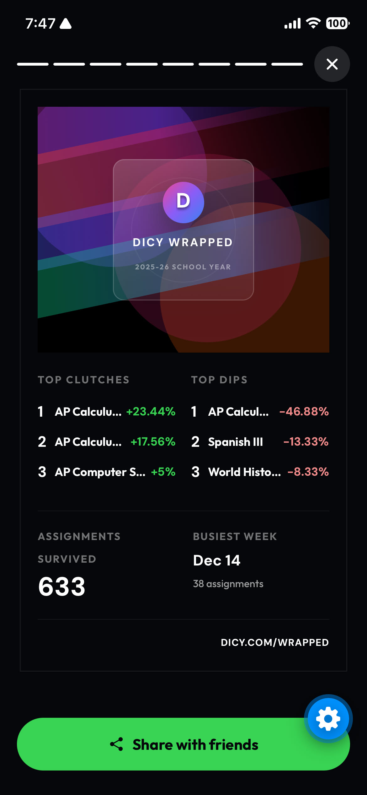
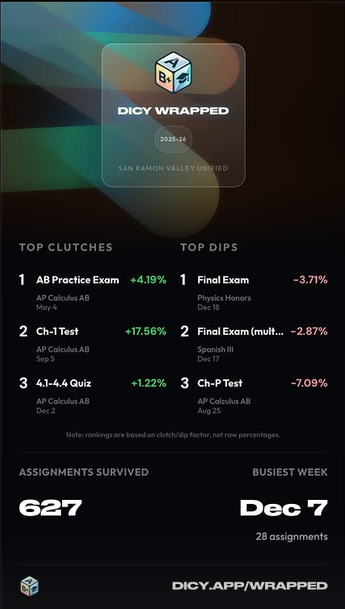

My first post about Dicy said "bessy is broken :(" and "so i built the next version." I wanted the what-if grades and final calculator back, so I started figuring out how Infinite Campus worked.

I watched the requests the portal made when I opened my grades and assignments, saved the network traffic, and worked out which responses I needed. There are still files in my Downloads called `termsinfcampus.har` and `infinitecampusnew1.har`. Getting the data was one problem. Getting the calculations to agree with the portal, and keeping login working across schools, took a lot more work.

*One of the April versions. I changed this screen a lot.*

Dicy grew to 3,000+ users. I added web, Android, widgets, and Schoology, but I was also fixing things people ran into. Even my v1.1 announcement had "works on school wifi" and "fixed final grade calculator" in it.

Then I wanted to make Dicy Wrapped. Basically Spotify Wrapped for your school year: the assignments that saved your grade, the ones that dropped it, and how much work you'd done.

I tried a bunch of AI-generated designs. The early cards had a huge D logo, colored blobs, and class names that got cut off. They looked like drafts because they were. I kept changing them.

There were problems underneath the design too. The biggest percentage on an assignment wasn't necessarily the one that helped your grade most. The rankings needed to account for its actual effect. And while I was finishing the share screen, I kept getting errors, including a missing native sharing module. I still have those screenshots from June 2 and 3.

*An early draft on the left. The later card on the right, with assignment names and their effect on the grade.*

Wrapped ended up getting over 120 shares on Instagram and 200 through Messages. After all those versions, people were actually sending their cards to friends. I'm really happy with how that turned out.

You can try [Dicy here](https://dicy.app).
