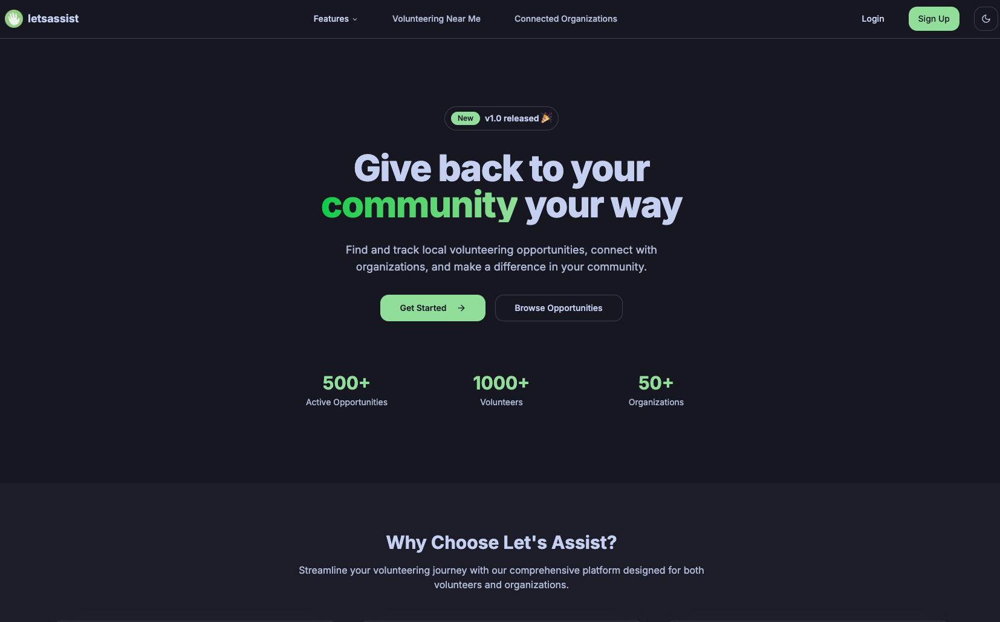

I first built Let's Assist with a friend for HarvestHacks in November 2023. The idea came from seeing trash on a beach in Santa Cruz and wanting a way to get people together to help. At school, I was also dealing with finding CJSF volunteer opportunities and getting hours signed off.

We mostly knew competitive programming. This was our first full-stack website, so getting login and the database working took a lot of the time. We started with fake data, then had to rework parts of the app when we connected the real database. The [Devpost submission](https://devpost.com/software/let-s-assist) still mentions the authentication issues and requests returning 404s.

The screenshot has placeholder text in it. We had something to submit, but it was a rough version of what I wanted to make. We didn't win anything, and I left it alone for about a year.

In December 2024, I came back to it and rebuilt it. I wanted an organization to be able to post an event, have students sign up, and keep track of their hours afterward. I worked on organization pages and QR check-ins, then certificates people could use as a record of their service.

As of May 2025, I'm starting to show it to people and ask what they'd need to use it. I have more of the product built, but I still need to find out how it fits the way teachers and volunteer groups run their events.

*October 2026: I wrote a [longer account of what happened next](/blog/lets-assist-beyond-the-demo), including the outreach, Troop 941, district review, and CSF.*
